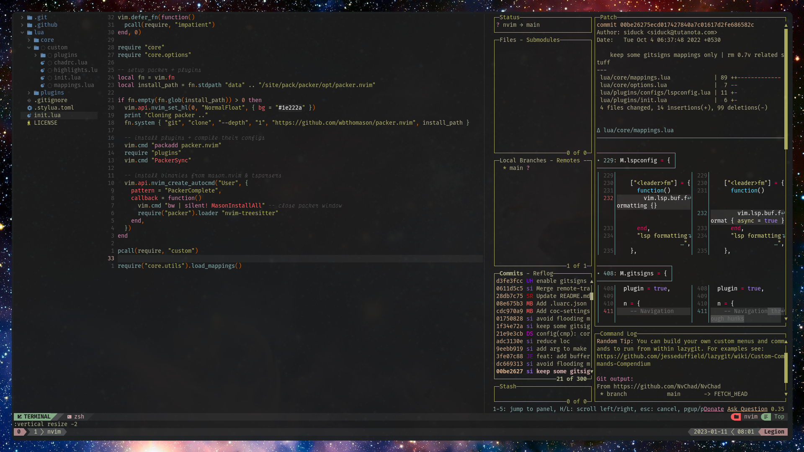
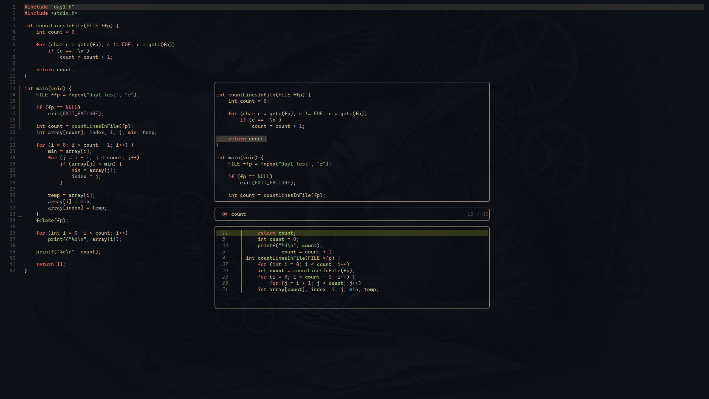

# Fenix 🔥





This repository it's a system backup and also the objective it's to have fast setup for migration.

## Install

You will need to use this command that I haven't created jet 😅 to set everything up

```
./install.sh
```

## TODO

List of things that I would like to add to this repo:

- Continue my packages list
- Get all dotfiles from differents programs
