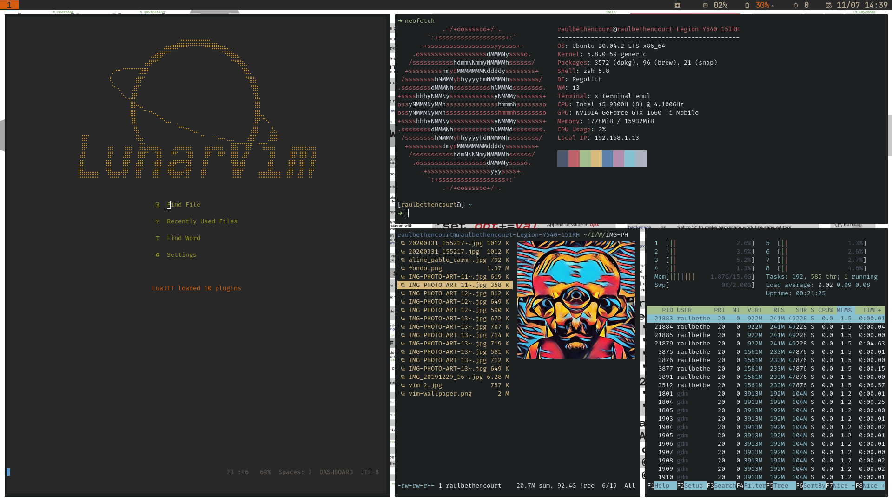

# Fenix 🔥



This repo it's a backup and also the objectif it's to have a fast setup for reinstallation or migration.

## Install

You will need you use this command that I haven't created jet 😅

```
./script.py
```

## TODO

List of things that I would like to add to this repo:

- Continue my packages list
- Get all dotfiles from differents programs
