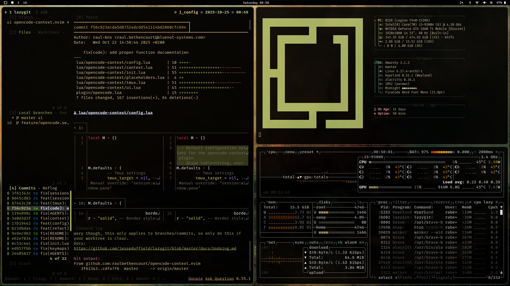
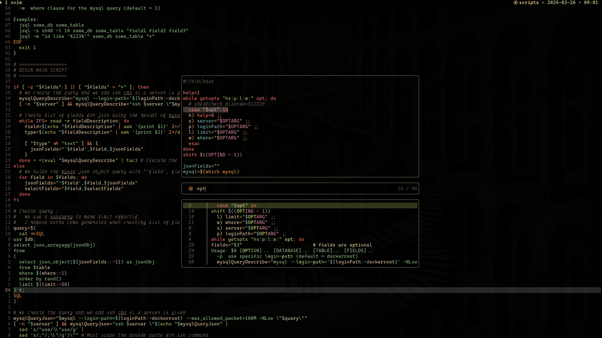

# Fenix 🔥





This repository it's a system backup and also fast setup integration.

>[!IMPORTANT] 
>Here are my own dotfiles. This can change very often, so there
>are the possiblitiy of breaking changes.

## Install

- You can use next command to start installation in ubuntu like os.

```bash ./install.sh ```

- Then you can reboot system and the use this other command.

```bash ./nix_install.sh ```

- I've just change to omarchy os. So now i have this after install script.

```bash ./omarchy_install.sh ```

Enjoy !!
